# Hướng dẫn debug cơ bản với Visual Studio

[Sử dụng Breakpoint](#breakpoint)\
[Sử dụng CallStack](#callstack)\
[Xem giá trị biến, biểu thức nhanh bằng chuột](#quickview)\
[Sử dụng Watch Window](#watchwindow)

> Lưu ý, chạy rồi mới debug được nhé

Thay vì đọc code và suy nghĩ xem lỗi ở đâu, ta nên dùng debug tool để tìm lỗi một cách nhanh gọn lẹ.

Debug trong Visual Studio cho phép bạn chạy chương trình từng bước để xem sự thay đổi giá trị của biến, giá trị trả về của hàm,... qua đó phát hiện những lỗi logic trong chương trình.

## Một số thành phần cơ bản

***Breakpoints***: Là điểm mà chương trình sẽ dừng lại để cho phép bạn chạy từng bước các dòng code. Có thể đặt nhiều breakpoint trong chương trình.

***Các cửa sổ theo dõi biến***: Giúp bạn theo dõi sự thay đổi của biến hoặc hàm cho mỗi bước chạy. Nếu một biến có sự thay đổi giá trị thì sẽ có màu đỏ để phân biệt. Có 3 loại:

- **Autos**: Hiển thị tự động các biến, hoặc hàm trả về trong các dòng code trước.
- **Locals**: Tương tự Autos nhưng chỉ hiển thị các biến liên quan trong nội bộ hàm hoặc khối lệnh.
- **Watch**: cửa sổ tùy chỉnh cho phép bạn xem chỉ các biến mà bạn yêu cầu hoặc giá trị tùy chỉnh bất kỳ. Visual Studio cho phép bạn mở tối đa 4 cửa sổ Watch.

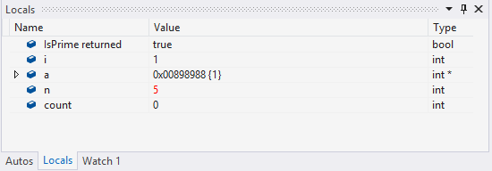

***Thanh công cụ Debug***: cung cấp các nút lệnh để bạn thực hiện Debug chương trình.

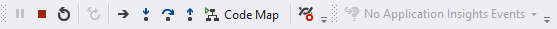

***Cửa sổ Call Stack***: Chứa lời gọi hàm trong ngăn xếp. Nếu chỉ debug ở mức độ cơ bản thì cũng không cần quan tâm cửa sổ này lắm.

***Cửa sổ Diagnostic Tool***: Chứa các công cụ chẩn đoán nâng cao. Cung cấp biểu đồ thời gian thực bộ nhớ, CPU,... mà chương trình sử dụng. Ngoài ra nó còn hiển thị các sự kiện được bắt và thời gian bắt.

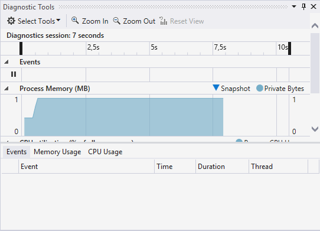

## Thực hiện debug 1 chương trình (cơ bản)

### Sử dụng Breakpoint 

Click vào rìa bên trái tại dòng code cần bắt đầu debug để đặt *breakpoint*. *Breakpoint* sẽ có màu đỏ như hình dưới.

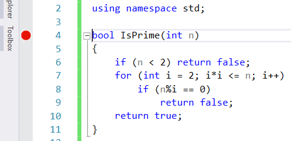

> Lưu ý là có thể đặt nhiều breakpoint khác nhau. Để xóa một breakpoint ta click vào nó một lần nữa.

Sau khi đặt *Breakpoints*, ta bắt đầu chạy chương trình dưới chế độ *Debug* bằng cách **nhấn phím F5**. Chương trình sẽ chạy bình thường cho tới khi gặp một *breakpoint* như hình dưới.

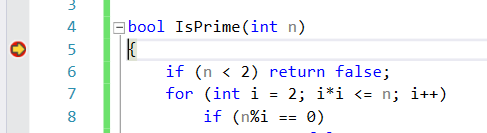

Bây giờ, ta sẽ sử dụng các nút lệnh trên **thanh công cụ Debug** để tiến hành chạy từng bước.
Các nút điều khiển Debug cơ bản:

- **Step Over (F10)**: chạy lần lượt các câu lệnh, tuy nhiên sẽ không đi vào trong hàm con mà chỉ lướt qua.
- **Step Into (F11)**:  chạy lần lượt các câu lệnh và đi vào hàm con.
- **Step Out (Shift + F11)**: Lướt qua hàm con hiện tại để trở về hàm trước. Ngoài ra có thể dùng nó để nhảy qua breakpoint kế tiếp.

### Sử dụng CallStack 

**Call Stack** dùng để xem các lời gọi hàm hoặc thủ tục hiện có trong *Stack*. Để mở cửa sổ **Call Stack** thì khi đang debug, chọn menu `Debug → Windows → Call Stack`

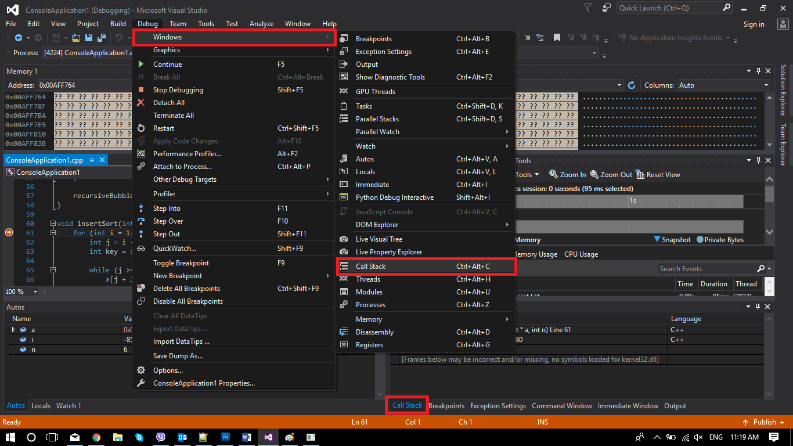

Cửa sổ sẽ Call Stack hiển thị tên của từng hàm kèm theo danh sách tham số, dòng code đang chạy, tên của ngôn ngữ lập trình…

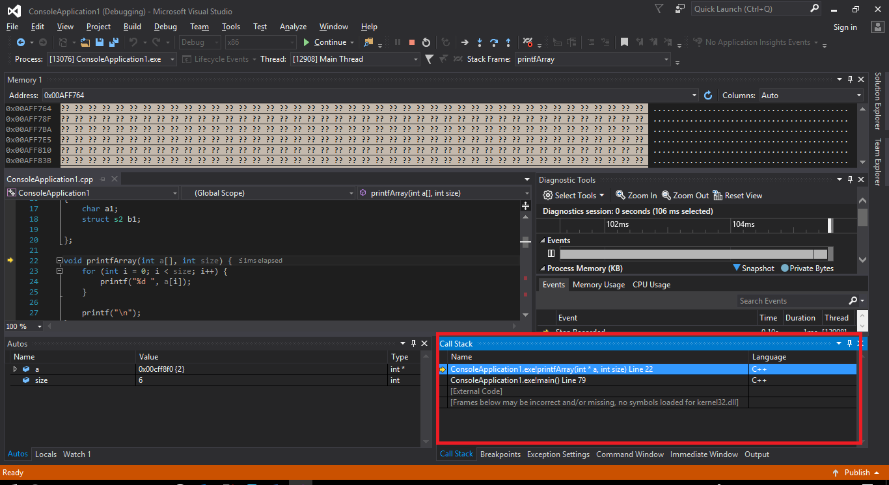

Mũi tên màu vàng chỉ ra Stack Frame nơi con trỏ thực thi đang nằm. Theo mặc định thì các thông tin liên quan của Frame này sẽ hiển thị trong các cửa sổ *Disassembly*, *Locals*, *Watch*, và *Autos*.

### Xem giá trị biến, biểu thức nhanh bằng chuột 

Trong quá trình Debug, bạn có thể di chuột đến bất kỳ biến nào để xem giá trị hoặc thay đổi giá trị của biến. Ngoài ra có thể ghim popup tại màn hình để tiện theo dõi.

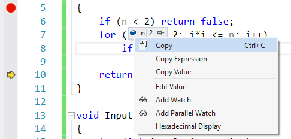

### Sử dụng Watch Window 

Watch Window là cửa sổ sử dụng để theo dõi sự thay đổi giá trị của các biến (local hay global đều được hết).

Để mở Watch Window ta `chọn menu Debug → Windows → Watch → Watch`

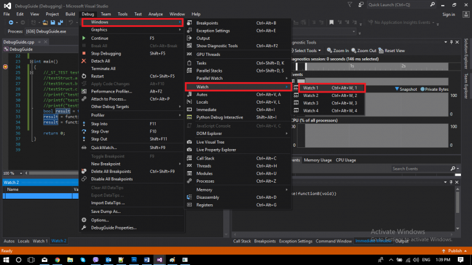

watch window sẽ hiện ra như hình dưới

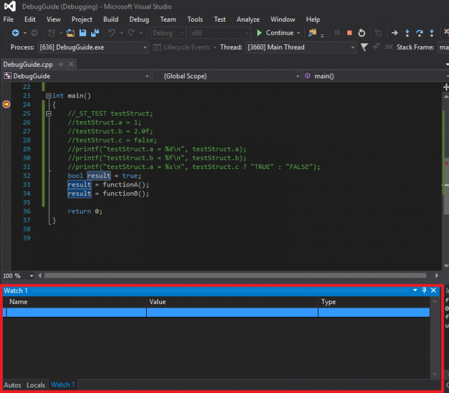

Để *theo dõi một biến ở Watch Window* bạn có 2 cách

***Cách 1***: Click chuột phải vào biến trên `editor → “Add Watch”`

***Cách 2***: Nhập tên biến vào cột `Name` trên Watch Window

Ngoài ra, thông tin có thể xem được từ Watch Window không giới hạn ở các biến bình thường. Bạn có thể nhập tên của một số biến đặc biệt để theo dõi, ví dụ:

- *esp*: giá trị hiện tại của stack pointer
- *err*: mã lỗi của hàm cuối cùng được gọi\
...

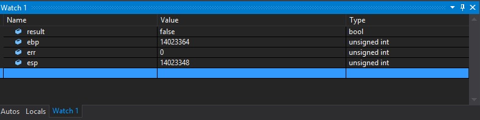

Ngoài ra, đối với các ứng dụng đa luồng ta có thể dùng `Thread Window` để debug. Với những bug căn chỉnh bộ nhớ ta có thể dùng `Memory Window`.
